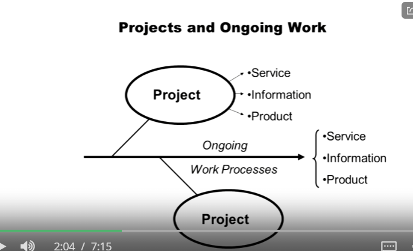
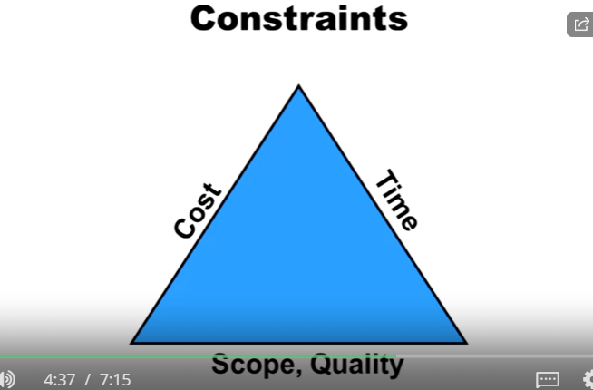
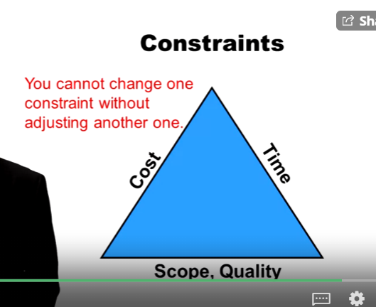
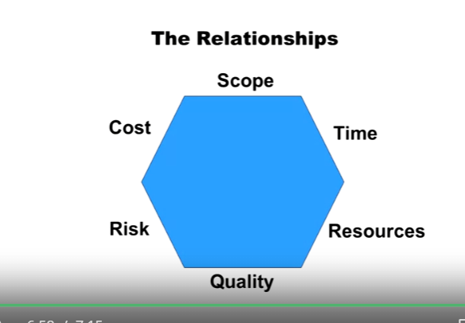

## 1.1 What is a Project?
A temporart, one-time, coordinated undertaking
1. has a definable goal
2. has interrelated and dependent activities tasks
3. is finite in duration
4. provides a unique **product**, **service** or **information**
5. operated under **scope**, **quality**, **cost** and **time** **(SQCT)** constraints

## Projects and Ongoing Work

Ongoing work is the usual mundane tasks that is done in your orgranization, whereas a project starts with a defined goal and duration. Ongoing work is repeatable, it has a proper process defined, for example- Billing info printing documents, getting a software installed, IT, Electricity, resources etc. are Ongoing work, whereas a project could be- BI report on Sales, Inventory Optimization, Sales Prediction etc.

## Project Constraints-

**Scope**-
1. How big is this project?
2. What does it include?

**Quality**-
1. How good this have to be?

**Cost**-
1. How much will it cost me?

**Time**-
1. How long will it take to complete the project?

You cannot change one constraint without adjusting another one.

## According to PMI (Project Management Institute)
SQCT aren't enough, they have added two more to the constraints-

1. Scope
2. Quality
3. Cost
4. Time
5. Risk
6. Resources

Now the relationships looks like this-

