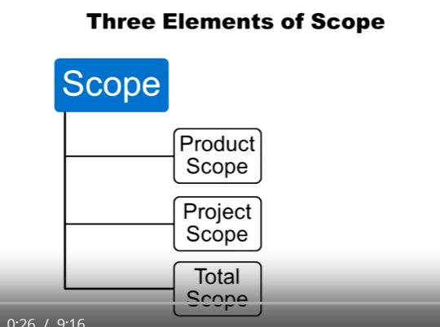

## 1.2 Scope
## Three Elements of Scope

1. Product Scope: All the **THINGS** that will be created or delivered
2. Project Scope: All the **WORK** that will be done during the project
3. Total Scope: All the **THINGS** and all the **WORK**

## Formal definition of Project-
According to Project Management of Institute- "A temporary endeavor undertaken to create a unique product, service or result"

## What is a Project Manager (PM)?
Project Manager has some skill basis-
1. Technical Skills
2. Project Management Process Skill
3. Leadership Skills

## Various Roles of the PM
1. Task & Human
2. Integrator vs. Technical Expert
3. Big Picture & Detail
4. Politics
5. Projects vs. Functions

## Formal definition of Project Manager-
According to Project Management of Institute- "The person assigned by the performing organization to achieve the project objectives."

## What is Project Management?
1. Planning
2. Scheduling
3. Managing
4. Coordinating
5. Leading
6. Communicating
7. Controlling
8. ...

## Formal definition of Project Management-
According to Project Management of Institute- "The application of knowledge, skills, tools, and techniques to project activities to meet project requirements. Project Management is accomplished through the use of processes such as: initiating, planning, executing, controlling and closing"

## Process Groups
The Project Management Institute defines 5 process groups for completing a project:
1. Initiate
2. Plan
3. Execute
4. Monitor and Control
5. Close

## Knowledge Areas
1. Project Integration Management
2. Project Scope Management
3. Project Time Management
4. Project Cost Management
5. Project Quality Management
6. Project Human Resources Management
7. Project Communications Management
8. Project Risk Management
9. Project Procurement Management
10. Project Stakeholder Management