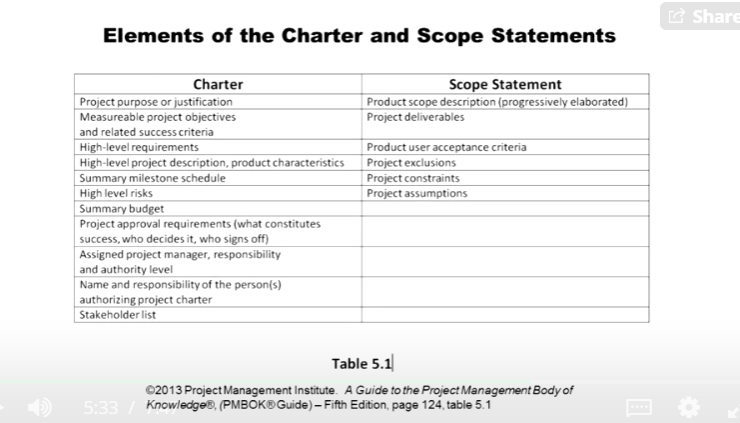

## 1.3 Planning and Scheduling
## Initiating
In this stage we will start defining the project, this starts the project.

## Stakeholder
Individuals and organizations that are actively involved in the project or whose interests may be positively or negatively affected as a result of the project execution or project completion. They may also exert influence over the project and its result.

## Customer
1. One of the overall list of stakeholders
2. Special subset of stakeholder
3. Individual or group that receives the deliverables of the project

## Project Charter
1. Agreement between all involved parties
2. One location for all overview information
3. Definition of the project
4. Guide for the project activities

## Example Project
**Project:** Remodal and expand the current sports stadium on a university campus.

The project will include:
- installing new turf
- putting in all new lighting
- adding 28% more seats
- constructing a new parking lot
- installing a new score board

### Who might be included on the Stakeholder List?
List alteast 3 people or groups you think might be interested in, involved with, or affected by this project.

Stakeholders-
    
    1. Owner of the University
    2. Dean of the University
    3. University students
    4. Faculty
    5. Athletic Department
    6. Home owners near the stadium
    7. City departments (street, utilities, etc.)
    8. ...

### Project Charter-

## Scope Statement
The description of the project scope, major deliverables, assumptions, and constraints

## In the example project Stadium
**Project:** Remodal and expand the current sports stadium on a university campus.

The project will include:
- installing new turf
- putting in all new lighting
- adding 28% more seats
- constructing a new parking lot
- installing a new score board

These look like the major deliverables of the project. These all are in the **Project Scope** of the project (because these do not contain the WORK, they only contain the THINGS).

### What are the major deliverables for this project?
List atleast 3 major deliverables for this project.

Deliverables-
    
    1. New turf
    2. New lightings
    3. 28% new seats
    4. Parking lot
    5. Score board