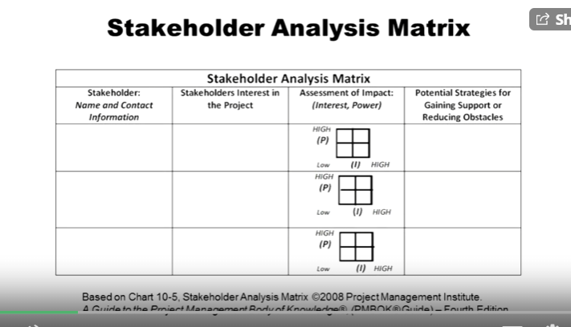
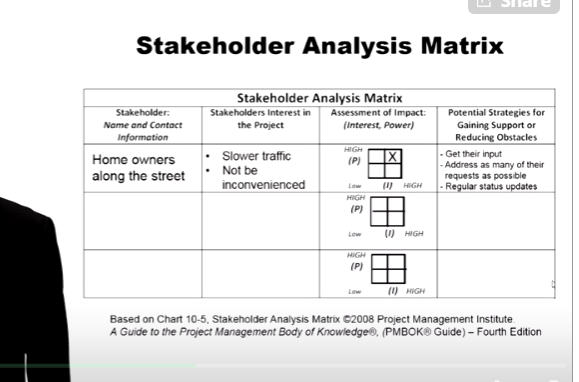
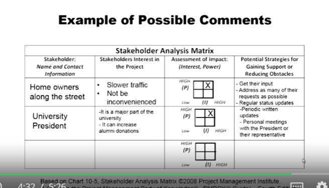

## 1.4 Stakeholder Analysis
A technique of systematically gathering and analyzing quantative and qualitative information to determine whose interests should be taken into account throughout the project.

## In the example project Stadium
**Project:** Remodal and expand the current sports stadium on a university campus.

The project will include:
- installing new turf
- putting in all new lighting
- adding 28% more seats
- constructing a new parking lot
- installing a new score board

## Stakeholder Analysis Matrix

